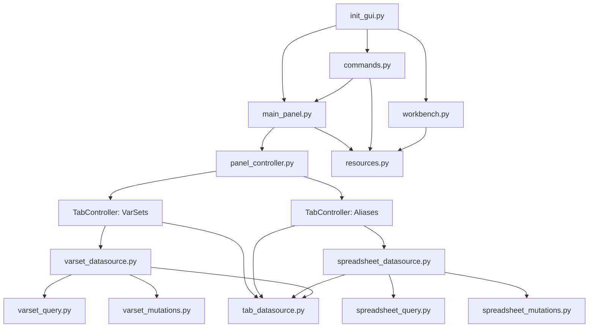
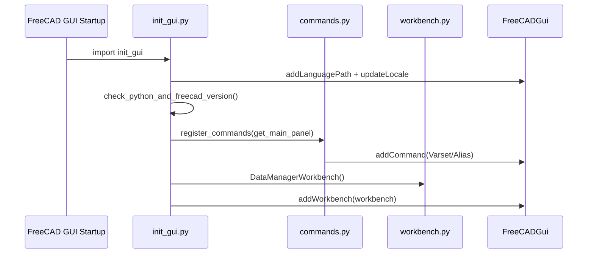
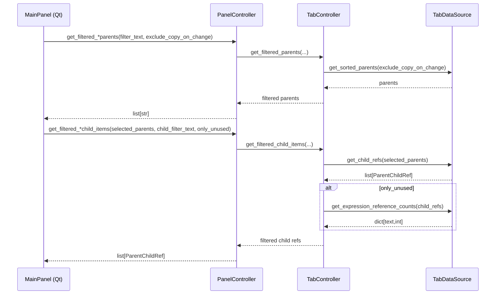
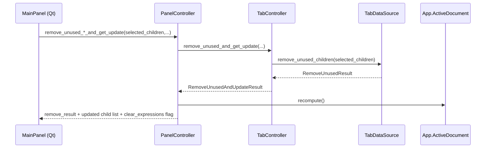

# Architecture

This document describes the current architecture of the **DataManager** FreeCAD workbench.

## Goals

- Provide a stable FreeCAD workbench entrypoint (commands, toolbar/menu, panel).
- Keep the Qt UI layer thin by delegating behavior to controllers.
- Reuse the same tab logic for different data domains (VarSets and Spreadsheet Aliases).
- Keep document queries/mutations isolated from the UI so they can be tested.

## High-level structure

- **FreeCAD integration / entrypoints**
  - `freecad/datamanager_wb/init_gui.py`
  - `freecad/datamanager_wb/workbench.py`
  - `freecad/datamanager_wb/commands.py`
- **UI layer (Qt)**
  - `freecad/datamanager_wb/main_panel.py` (loads `.ui`, wires signals)
  - `freecad/datamanager_wb/resources/ui/main_panel.ui`
- **Controller layer**
  - `freecad/datamanager_wb/panel_controller.py` (UI-facing facade, owns recompute/GUI refresh)
  - `freecad/datamanager_wb/tab_controller.py` (generic per-tab logic)
- **Data access layer**
  - VarSets:
    - `freecad/datamanager_wb/varset_query.py` (low-level FreeCAD VarSet queries)
    - `freecad/datamanager_wb/varset_mutations.py` (low-level FreeCAD VarSet mutations)
    - `freecad/datamanager_wb/varset_datasource.py` (adapts varset APIs to generic tab API)
  - Spreadsheet Aliases:
    - `freecad/datamanager_wb/spreadsheet_query.py`
    - `freecad/datamanager_wb/spreadsheet_mutations.py`
    - `freecad/datamanager_wb/spreadsheet_datasource.py` (adapts spreadsheet APIs to generic tab API)
- **Shared types/helpers**
  - `freecad/datamanager_wb/tab_datasource.py` (`TabDataSource` protocol + shared result types)
  - `freecad/datamanager_wb/parent_child_ref.py` (`ParentChildRef` used for list items)
  - `freecad/datamanager_wb/expression_item.py` (`ExpressionItem` for expression list UI)
  - `freecad/datamanager_wb/gui_selection.py` (select referenced objects from expression items)
  - `freecad/datamanager_wb/parsing_helpers.py` (parsing/format helpers for display strings)
- **Resources**
  - `freecad/datamanager_wb/resources.py` (absolute paths to icons/translations/ui)
  - `freecad/datamanager_wb/resources/icons/*`
  - `freecad/datamanager_wb/resources/translations/*`

## Module map

## FreeCAD startup and workbench registration

At FreeCAD startup, `init_gui.py` is imported by FreeCAD’s workbench discovery process. It performs:

- Version checks (`check_python_and_freecad_version`).
- Translation path setup (`Gui.addLanguagePath`, `Gui.updateLocale`).
- Command registration (`register_commands`).
- Workbench registration (`Gui.addWorkbench(DataManagerWorkbench())`).

## UI architecture: MainPanel

`main_panel.py`:

- Loads the Qt Designer file `resources/ui/main_panel.ui`.
- Locates required widgets by object name.
- Wires signals (selection changes, filter changes, button presses).
- Delegates behavior (querying lists, remove-unused, expression discovery) to `PanelController`.

**Key principle:** the Qt layer should not directly reach into FreeCAD document APIs beyond what is needed for UI wiring; domain operations go through the controller.

## Controller architecture

### `PanelController` (UI-facing facade)

`panel_controller.py` is intentionally GUI-oriented:

- Owns two tab controllers:
  - VarSets: `TabController(VarsetDataSource())`
  - Aliases: `TabController(SpreadsheetDataSource())`
- Provides UI-friendly methods with “VarSet/Spreadsheet” names.
- Owns the **document refresh** boundary (`doc.recompute()` and `Gui.updateGui()`).

This keeps recompute/update behavior consistent and prevents the UI from sprinkling recompute calls throughout the code.

### `TabController` (generic tab logic)

`tab_controller.py` contains tab-generic behaviors:

- Normalizes filter text into glob patterns.
- Filters parent lists (VarSets / Spreadsheets).
- Filters child lists (Variables / Aliases).
- Implements **only-unused** behavior by using reference counts.
- Implements enable/disable rules for the “Remove unused” buttons.
- Orchestrates the “remove unused + refresh list” operation by returning:
  - what was removed / still used / failed
  - how the UI should update after mutation

## Data access architecture

### `TabDataSource` protocol

`tab_datasource.py` defines a small, UI-friendly interface used by `TabController`:

- `get_sorted_parents(exclude_copy_on_change)`
- `get_child_refs(selected_parents)`
- `get_expression_items(selected_children)`
- `get_expression_reference_counts(selected_children)`
- `remove_unused_children(selected_children)`

This makes it possible to share the tab behavior between different domains.

### VarSets

VarSets are backed by FreeCAD’s `App::VarSet`. The repository keeps VarSet-specific logic in:

- `varset_query.py` (thin wrappers around FreeCAD VarSet query APIs)
- `varset_mutations.py` (thin wrappers around FreeCAD VarSet mutation APIs)
- `varset_datasource.py` (adapter to the generic protocol)

### Spreadsheet aliases

Aliases are backed by FreeCAD’s Spreadsheet objects.

The alias implementation is split into:

- `spreadsheet_query.py` (discover spreadsheets, discover aliases, find references)
- `spreadsheet_mutations.py` (remove alias)
- `spreadsheet_datasource.py` (adapter to the generic protocol)

The query/mutation layer is designed to tolerate FreeCAD API differences across versions (for example, environments that only provide `getAlias(cell)` rather than bulk alias enumeration).

## Key flows

### Populate and filter lists

### Remove unused (button)

At the UI level, the “remove unused” buttons are enabled only when:

- the tab’s “Only Unused” checkbox is on, and
- at least one child item is selected.

Mutation is performed through the controller, which recomputes the document and returns a post-mutation UI update.

## Resources and packaging

- Runtime resource access goes through `resources.py`, which computes paths relative to the `freecad/datamanager_wb` package directory.
- `MANIFEST.in` includes `freecad/datamanager_wb/resources/*` so UI/icons/translations are shipped.

## Notes / constraints

- FreeCAD entrypoints and GUI integration are necessarily runtime-dependent (FreeCAD + Qt bindings), so strict static analysis is limited in those areas.
- Unit tests focus on the tab-generic logic (`TabController`) using a fake data source.
