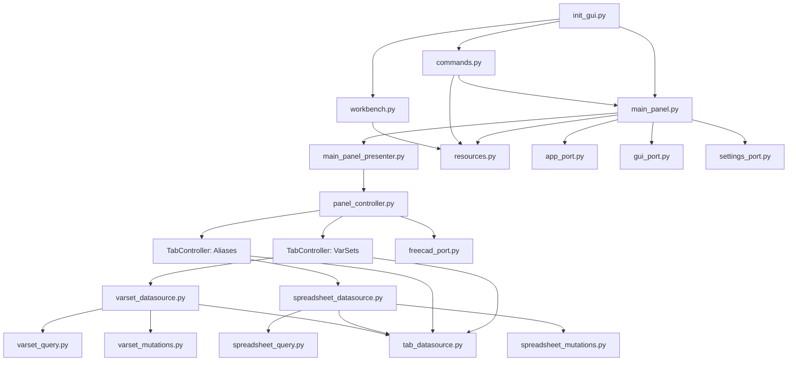
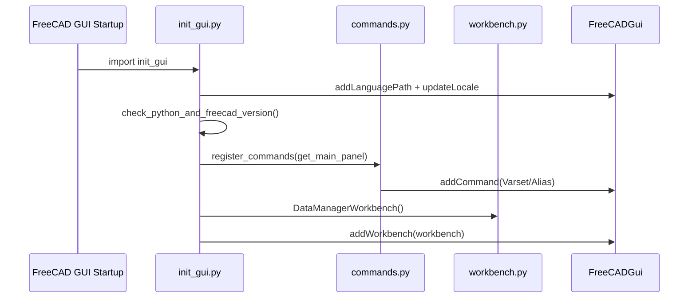
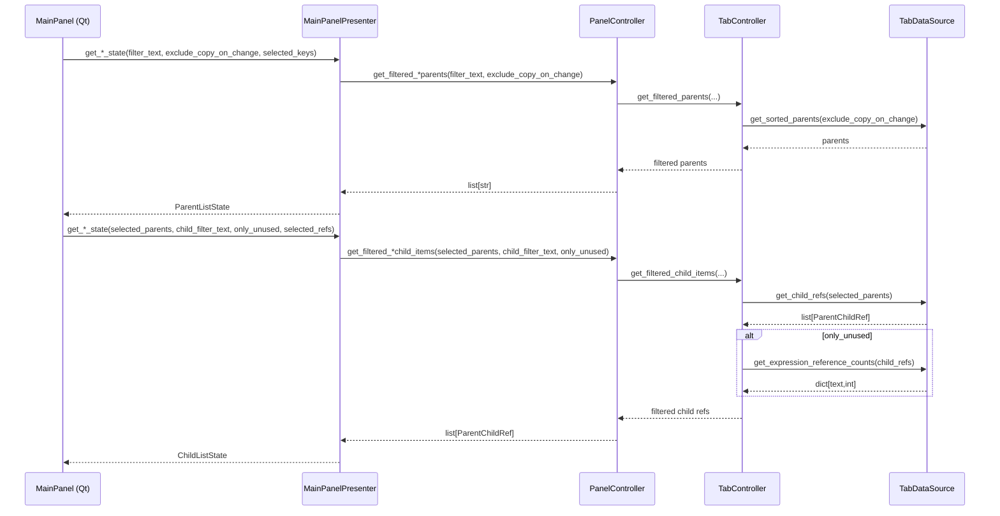
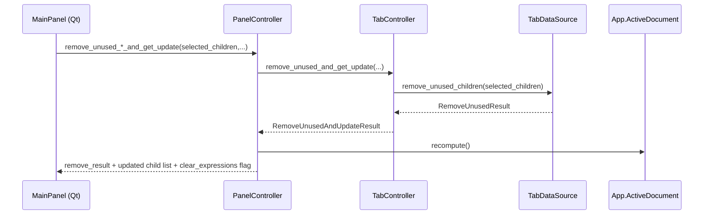

# Architecture

This document describes the current architecture of the **DataManager** FreeCAD workbench.

## Goals

- Provide a stable FreeCAD workbench entrypoint (commands, toolbar/menu, panel).
- Keep the Qt UI layer thin by delegating behavior to presenters/controllers.
- Reuse the same tab logic for different data domains (VarSets and Spreadsheet Aliases).
- Keep document queries/mutations isolated from the UI so they can be tested.
- Make core modules importable and testable without a running FreeCAD GUI.

## High-level structure

- **FreeCAD integration / entrypoints (runtime)**
  - `freecad/datamanager_wb/init_gui.py`
  - `freecad/datamanager_wb/entrypoints/workbench.py`
  - `freecad/datamanager_wb/entrypoints/commands.py`
- **UI layer (Qt)**
  - `freecad/datamanager_wb/ui/main_panel.py` (Qt widget wiring + rendering)
  - `freecad/datamanager_wb/resources/ui/main_panel.ui`
- **Presenter layer**
  - `freecad/datamanager_wb/ui/main_panel_presenter.py` (list state, formatting, orchestration plans)
- **Controller layer**
  - `freecad/datamanager_wb/ui/panel_controller.py` (UI-facing facade; owns recompute/GUI refresh)
  - `freecad/datamanager_wb/domain/tab_controller.py` (generic per-tab logic)
- **Data access layer**
  - VarSets:
    - `freecad/datamanager_wb/varsets/varset_query.py` (low-level FreeCAD VarSet queries)
    - `freecad/datamanager_wb/varsets/varset_mutations.py` (low-level FreeCAD VarSet mutations)
    - `freecad/datamanager_wb/varsets/varset_datasource.py` (adapts varset APIs to generic tab API)
  - Spreadsheet Aliases:
    - `freecad/datamanager_wb/spreadsheets/spreadsheet_query.py`
    - `freecad/datamanager_wb/spreadsheets/spreadsheet_mutations.py`
    - `freecad/datamanager_wb/spreadsheets/spreadsheet_datasource.py` (adapts spreadsheet APIs to generic tab API)
- **Ports & adapters (FreeCAD/GUI boundaries)**
  - FreeCAD runtime:
    - `freecad/datamanager_wb/ports/freecad_context.py` (`FreeCadContext` + `get_runtime_context()`)
    - `freecad/datamanager_wb/ports/freecad_port.py` (`FreeCadPort` + adapter + `get_port(ctx)`)
  - UI runtime boundaries:
    - `freecad/datamanager_wb/ports/app_port.py` (`AppPort` for translation)
    - `freecad/datamanager_wb/ports/gui_port.py` (`GuiPort` for FreeCADGui/PySideUic + MDI integration)
    - `freecad/datamanager_wb/ports/settings_port.py` (`SettingsPort` for persisted UI settings)
- **Shared types/helpers**
  - `freecad/datamanager_wb/domain/tab_datasource.py` (`TabDataSource` protocol + shared result types)
  - `freecad/datamanager_wb/domain/parent_child_ref.py` (`ParentChildRef` used for list items)
  - `freecad/datamanager_wb/freecad_helpers.py` (shared FreeCAD document/query helpers)
  - `freecad/datamanager_wb/domain/expression_item.py` (`ExpressionItem` for expression list UI)
  - `freecad/datamanager_wb/ui/gui_selection.py` (select referenced objects from expression items)
  - `freecad/datamanager_wb/domain/parsing_helpers.py` (parsing/format helpers for display strings)
- **Resources**
  - `freecad/datamanager_wb/resources.py` (absolute paths to icons/translations/ui)
  - `freecad/datamanager_wb/resources/icons/*`
  - `freecad/datamanager_wb/resources/translations/*`

## Architectural principles

- **Ports at runtime boundaries**

  - Code that needs FreeCAD runtime is routed through `FreeCadPort`.
  - Code that needs FreeCADGui / PySideUic is routed through `GuiPort`.
  - Translation is routed through `AppPort`.
  - Settings persistence is routed through `SettingsPort`.

- **Dependency injection by optional context/ports**

  - Data/query/mutation functions accept `ctx: FreeCadContext | None` and call `get_port(ctx)`.
  - UI widgets accept optional injected ports (defaults to runtime adapters).

- **Presenter owns UI state and formatting decisions**

  - The Qt widget (`MainPanel`) renders lists and forwards user events.
  - The presenter computes list state, selection preservation, and formatting (including label-mode).

## Module map

## FreeCAD startup and workbench registration

At FreeCAD startup, `init_gui.py` is imported by FreeCAD’s workbench discovery process. It performs (when FreeCADGui is available):

- Version checks (`check_python_and_freecad_version`).
- Translation path setup (`Gui.addLanguagePath`, `Gui.updateLocale`).
- Command registration (`register_commands`).
- Workbench registration (`Gui.addWorkbench(DataManagerWorkbench())`).

Implementation note:

- The entrypoint modules (`init_gui.py`, `workbench.py`, `commands.py`, `freecad_version_check.py`) are structured to be importable outside FreeCAD by using guarded/lazy imports.

## UI architecture: MainPanel

`main_panel.py`:

- Loads the Qt Designer file `resources/ui/main_panel.ui`.
- Locates required widgets by object name.
- Wires signals (selection changes, filter changes, button presses).
- Delegates formatting, list state, and orchestration decisions to `MainPanelPresenter`.
- Delegates data operations to `PanelController`.

In addition, the panel is responsible for a few UI-only behaviors:

- Keeping list panes in sync with the **active FreeCAD document** when multiple documents are open.
- Providing right-click **context menus** for list widgets (for common actions like copy).

The UI uses splitters inside each tab so the list panes and expressions pane can be resized.

The expressions panes include a **Show Objects as: Name/Label** mode, persisted via `SettingsPort`. The VarSets and
Aliases tabs each store their mode independently.

**Key principle:** the Qt widget should not reach into FreeCAD document APIs directly; it should go through injected ports and the controller.

### UI ports used by MainPanel

- **`AppPort`** (`app_port.py`)
  - `translate(context, text)`
- **`GuiPort`** (`gui_port.py`)
  - Load `.ui` files
  - Provide MDI integration (`QMdiArea`, `addSubWindow`)
- **`SettingsPort`** (`settings_port.py`)
  - Persist display mode and splitter state

These are injected into `MainPanel` (with runtime defaults), which makes `main_panel.py` importable and testable without FreeCAD.

## Controller architecture

### `PanelController` (UI-facing facade)

`panel_controller.py` is intentionally GUI-oriented:

- Owns two tab controllers:
  - VarSets: `TabController(VarsetDataSource())`
  - Aliases: `TabController(SpreadsheetDataSource())`
- Provides UI-friendly methods with “VarSet/Spreadsheet” names.
- Owns the **document refresh** boundary (`doc.recompute()` and `Gui.updateGui()`) through `FreeCadPort`.

This keeps recompute/update behavior consistent and prevents the UI from sprinkling recompute calls throughout the code.

`panel_controller.py` reuses the shared result/update dataclasses from `tab_datasource.py` rather than defining its own copies.

### `TabController` (generic tab logic)

`tab_controller.py` contains tab-generic behaviors:

- Normalizes filter text into glob patterns.
- Filters parent lists (VarSets / Spreadsheets).
- Filters child lists (Variables / Aliases).
- Implements **only-unused** behavior by using reference counts.
- Implements enable/disable rules for the “Remove unused” buttons.
- Orchestrates the “remove unused + refresh list” operation by returning:
  - what was removed / still used / failed
  - how the UI should update after mutation

Selections are normalized via the shared helper in `parent_child_ref.py` so callers can pass either `ParentChildRef` objects or raw `"Parent.Child"` strings.

## Data access architecture

### `TabDataSource` protocol

`tab_datasource.py` defines a small, UI-friendly interface used by `TabController`:

- `get_sorted_parents(exclude_copy_on_change)`
- `get_child_refs(selected_parents)`
- `get_expression_items(selected_children)`
- `get_expression_reference_counts(selected_children)`
- `remove_unused_children(selected_children)`

This makes it possible to share the tab behavior between different domains.

### VarSets

VarSets are backed by FreeCAD’s `App::VarSet`. The repository keeps VarSet-specific logic in:

- `varsets/varset_query.py` (thin wrappers around FreeCAD VarSet query APIs)
- `varsets/varset_mutations.py` (thin wrappers around FreeCAD VarSet mutation APIs)
- `varsets/varset_datasource.py` (adapter to the generic protocol)

VarSets can organize variables into **property groups** (for example, the default `Base` group). When a VarSet
contains variables in more than one group, the VarSets tab exposes **virtual parent entries**:

- `VarSetName.GroupName`

Selecting a virtual parent filters the variables list to only variables from that group.

Implementation detail:

- Group discovery lives in `varsets/varset_query.py` (property group mapping / filtering helpers).
- Virtual parent generation and group filtering is implemented in `varsets/varset_datasource.py`.

VarSet and spreadsheet query code shares common FreeCAD document helpers in `freecad_helpers.py` (expression engine iteration, copy-on-change filtering, typed object lookup).

### Spreadsheet aliases

Aliases are backed by FreeCAD’s Spreadsheet objects.

The alias implementation is split into:

- `spreadsheets/spreadsheet_query.py` (discover spreadsheets, discover aliases, find references)
- `spreadsheets/spreadsheet_mutations.py` (remove aliases)
- `spreadsheets/spreadsheet_datasource.py` (adapter to the generic protocol)

The query/mutation layer is designed to tolerate FreeCAD API differences across versions (for example, environments that only provide `getAlias(cell)` rather than bulk alias enumeration).

In the UI, spreadsheet alias definition rows are displayed using `:=` (to distinguish definition from normal
expressions).

## Key flows

### Populate and filter lists

### Remove unused (button)

At the UI level, the “remove unused” buttons are enabled only when:

- the tab’s “Only Unused” checkbox is on, and
- at least one child item is selected.

Mutation is performed through the controller, which recomputes the document and returns a post-mutation UI update.

## Resources and packaging

- Runtime resource access goes through `resources.py`, which computes paths relative to the `freecad/datamanager_wb` package directory.
- `MANIFEST.in` includes `freecad/datamanager_wb/resources/*` so UI/icons/translations are shipped.

## Notes / constraints

- FreeCAD entrypoints and GUI integration are necessarily runtime-dependent (FreeCAD + Qt bindings), but modules are structured so they can be imported in unit tests via guarded/lazy imports.
- Unit tests focus on:
  - Presenter logic (`MainPanelPresenter`) without Qt.
  - Tab-generic logic (`TabController`) using a fake data source.
