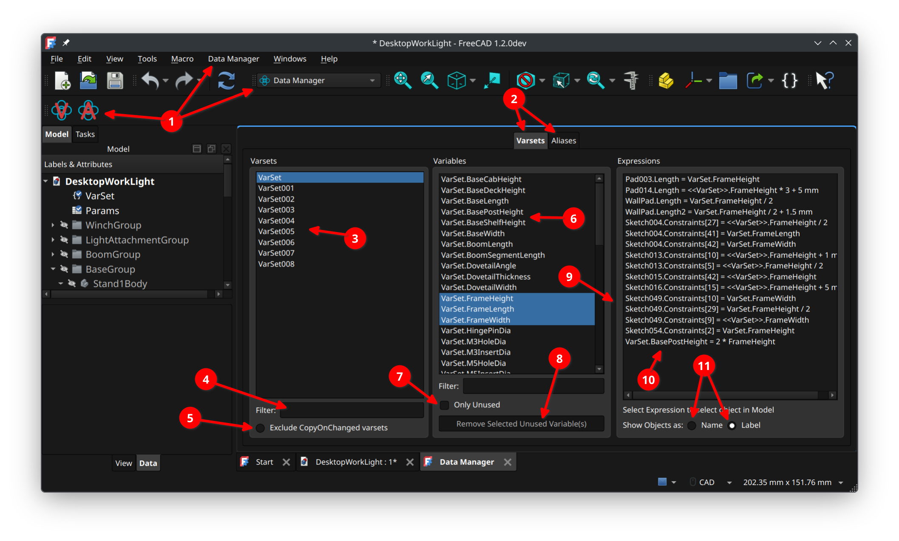

# DataManager Workbench User Guide

This guide explains how to use the **DataManager** FreeCAD workbench to:

- Browse and filter **VarSets** and their variables.
- Browse and filter **Spreadsheet** objects and their alias names.
- Inspect **expression references** to variables/aliases.
- Identify and remove **unused** variables/aliases.

This document intentionally does **not** include installation instructions.

## Annotated UI overview

Annotated UI legend:

1. Workbench selection (workbench selector, Data Manager menu, and toolbar icons)
1. VarSets and Aliases tabs
1. Available VarSets
1. VarSets filter
1. Exclude CopyOnChanged varsets checkbox
1. Variables list
1. Only Unused checkbox
1. Remove Selected Unused Variables button
1. Splitter (resizable pane divider)
1. Expressions list
1. Show Objects as: Name/Label radio buttons
1. Copy Selection Buttons
1. Shows selected expression selects object in model view

## Opening the DataManager panel

The workbench provides two FreeCAD commands:

- **Varset Management** (opens the panel focused on the Varsets tab)
- **Alias Management** (opens the panel focused on the Aliases tab)

Depending on your FreeCAD setup, you can access these via:

- The workbench toolbar
- The workbench menu
- The command search

See the annotated screenshot above (1).

When opened, the panel contains two tabs:

- **Varsets**
- **Aliases**

## Shared UI concepts (both tabs)

### Selection model

- Parent lists (VarSets / Spreadsheets) support **multi-selection**.
- Child lists (Variables / Aliases) support **multi-selection**.
- Expression lists support **single selection**.

Multi-selection is useful for:

- Viewing variables/aliases across multiple parents.
- Removing unused items across multiple parents.

### Filtering

Both parent and child lists have a **Filter** field.

- If you type plain text (no glob characters), it behaves like a **substring** match.
- If you include glob characters (`*`, `?`, `[]`), the filter is treated as a **glob pattern**.

Examples:

- `bolt` matches anything containing `bolt`
- `Bolt*` matches names beginning with `Bolt`
- `*Sketch??` matches names ending with `Sketch` followed by exactly two characters

### Copy button

Each list pane includes a copy button (icon-only).

- Clicking it copies the current list selection to the clipboard.
- For multi-selection lists, each selected item is copied on its own line.
- The copy button is enabled only when the list has focus and at least one item is selected.

See the annotated screenshot above (12).

### Right-click list menu

All list widgets support a right-click context menu with:

- **Select All** (for multi-selection lists)
- **Copy**

This is a convenience alternative to the copy button.

### “Exclude Copy-on-Change” / clone filtering

Both tabs include an option to hide objects created by FreeCAD’s copy-on-change mechanism.

- In the Varsets tab this hides copy-on-change derived VarSets.
- In the Aliases tab this hides copy-on-change derived Spreadsheets.

If you are working in documents where copy-on-change creates many “duplicate” helper objects, enabling this option helps reduce noise.

### Splitters (resizable panes)

Each tab uses a splitter so you can resize:

- The list panes (parents/children)
- The expressions pane

The splitter position is saved and restored.

See the annotated screenshot above (9).

### “Show Objects as: Name / Label”

Each tab includes a **Name/Label** display toggle for expression items.

- **Name** shows expression object references using FreeCAD internal object names.
- **Label** shows expression object references using FreeCAD object labels (more user-friendly).

This setting is remembered separately for the Varsets and Aliases tabs.

See the annotated screenshot above (11).

### Selecting an object from an expression

At the bottom of each expressions pane, the UI indicates:

- “Select Expression to select object in Model”

When you click an expression entry in the list, the workbench will attempt to select the referenced object in the FreeCAD model.

Tip: If you don’t see anything selected, the expression may reference a property or sub-element that can’t be selected directly, or the object may no longer exist.

See the annotated screenshot above (13).

## Varsets tab

The Varsets tab helps you audit variables stored in `App::VarSet` objects.

### 1) List and filter VarSets

- The left pane shows available VarSets.
- Use **Filter** to narrow the list.
- Optionally enable **Exclude Copy-on-Change** to hide copy-on-change derived VarSets.

See the annotated screenshot above (3), (4), (5).

### 2) Select VarSets to view variables

Select one or more VarSets. The middle pane populates with variable items formatted as:

- `VarSetName.VariableName`

These entries are shown as structured list items, but you can treat them as plain “VarSet.Variable” identifiers.

If your VarSet variables are organized into multiple **property groups**, the VarSets list may also include
virtual entries of the form:

- `VarSetName.GroupName`

Selecting a virtual entry filters the Variables list to only variables from that group.

### 3) Filter variables

Use the variable filter to narrow down variable names.

This is useful when VarSets contain many properties.

See the annotated screenshot above (6).

### 4) Inspect expression references

Select one or more variables. The expressions pane will populate with:

- Expressions from the document expression engine that reference the selected variable(s).

The list can include multiple objects/properties referencing the variable.

If you enable **Show Objects as: Label**, the object prefix shown in expressions will use the FreeCAD label.

See the annotated screenshot above (10), (11).

### 5) Find unused variables (“Only Unused”)

Enable **Only Unused** to show only variables with **zero** expression references.

- When enabled, the workbench calculates expression reference counts.
- The variable list is filtered to items with count `0`.

This mode is intended to help you safely clean up unused variables.

See the annotated screenshot above (7).

### 6) Remove selected unused variables

When **Only Unused** is enabled and you select one or more variables, the button:

- **Remove Selected Unused Variable(s)**

becomes enabled.

Clicking the button:

1. Shows a confirmation dialog.
1. Attempts to remove the selected variables.
1. Recomputes the document and refreshes the GUI.
1. Updates the variable list (and clears expressions if appropriate).

If some variables could not be removed, the UI will show an informational message.

Notes:

- If a variable is actually referenced (or the system detects it as referenced), it may be reported as “still used” and left in place.
- If a variable cannot be parsed or removed due to an error, it may be reported as “failed”.

See the annotated screenshot above (8).

## Aliases tab

The Aliases tab helps you audit spreadsheet aliases defined on `Spreadsheet::Sheet` objects.

### 1) List and filter Spreadsheets

- The left pane shows spreadsheet objects.
- Use **Filter** to narrow the list.
- Optionally enable **Exclude Copy-on-Change** to hide copy-on-change derived spreadsheets.

See the annotated screenshot above (2) for the tab switch; the Aliases tab has the same layout.

### 2) Select spreadsheets to view alias names

Select one or more spreadsheets. The middle pane populates with alias items formatted as:

- `SpreadsheetName.AliasName`

### 3) Filter alias names

Use the alias filter to narrow the list.

See the annotated screenshot above (6) for the child list area (the Aliases tab uses the same location).

### 4) Inspect alias references (expressions)

Select one or more aliases. The expressions pane will populate with expression entries referencing the selected alias(es).

The expressions list can include:

- Normal expression references from other objects.
- Spreadsheet-internal alias usage.

In the UI, alias “definition” style entries are displayed using `:=` to distinguish them from normal expressions.

See the annotated screenshot above (10).

### 5) Find unused aliases (“Only Unused”)

Enable **Only Unused** to show only alias names with **zero** expression references.

See the annotated screenshot above (7) for the checkbox location (the Aliases tab uses the same control).

### 6) Remove selected unused aliases

When **Only Unused** is enabled and you select one or more aliases, the button:

- **Remove Selected Unused Alias(es)**

becomes enabled.

Clicking the button:

1. Shows a confirmation dialog.
1. Attempts to remove the selected aliases.
1. Recomputes the document and refreshes the GUI.
1. Updates the alias list (and clears expressions if appropriate).

If some aliases could not be removed, the UI will show an informational message.

See the annotated screenshot above (8) for the button location (the Aliases tab uses the same control).

## Practical workflows

### Clean up unused items safely

Recommended steps:

1. Select the parents (VarSets or Spreadsheets) you want to clean.
1. Enable **Only Unused**.
1. Multi-select the items you want to remove.
1. Inspect the expressions list to build confidence that the items are truly unused.
1. Click **Remove Selected Unused …** and confirm.

### Audit a single variable/alias

Recommended steps:

1. Filter the child list to the variable/alias name.
1. Select the item.
1. Review expression references.
1. Click an expression entry to jump/select the referenced object in the model.

## Tips and troubleshooting

- If lists appear empty:

  - Verify you have an active document open.
  - Confirm the document contains VarSets or Spreadsheets.
  - Clear the filter fields.
  - Disable “Exclude Copy-on-Change” to see everything.

- If you have multiple FreeCAD documents open:

  - The panel follows the **active document**. If you switch the active document in the model view, the workbench
    refreshes to show VarSets/Aliases for that document.

- If “Remove Selected Unused …” is disabled:

  - Ensure **Only Unused** is enabled.
  - Ensure at least one child item is selected.

- If expressions are not showing what you expect:

  - Expression discovery is based on FreeCAD’s expression engine entries.
  - Some references may not be represented as standard expression-engine entries.

## Notes and constraints

- The workbench is designed to tolerate differences in FreeCAD APIs across versions.
- It is possible for an item to be “unused” according to expression scanning but still be meaningful to your workflow (for example, referenced by external scripts/macros). Use judgment before deleting.
